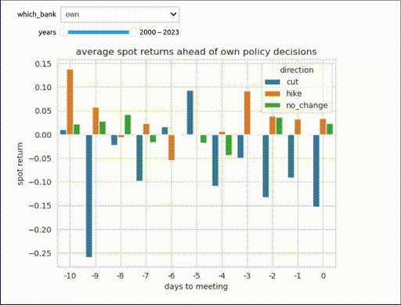

# foresight-saga

fx rates ahead of monetary policy meetings around the globe; implementation of dmitry borisenko and igor pozdeev's paper ([ssrn link](https://papers.ssrn.com/sol3/papers.cfm?abstract_id=2983043)).



# installation

```
git clone https://github.com/ipozdeev/foresight-saga
cd /path/to/foresight-saga
```

## docker
```
doker build -t foresight-saga
docker run --rm \
    -p 8888:8888 \
    -v $(pwd):/home/jovyan/work \
    foresight-saga
```

# project structure

    ├── README.md          <- The top-level README for developers using this project.
    ├── data
    │   ├── external       <- Data from third party sources.
    │   ├── interim        <- Intermediate data that has been transformed.
    │   ├── processed      <- The final, canonical data sets for modeling.
    │   └── raw            <- The original, immutable data dump.
    │
    ├── notebooks          <- Jupyter notebooks.
    │
    ├── references         <- Data dictionaries, manuals, and all other explanatory materials.
    │
    ├── reports            <- Generated analysis as HTML, PDF, LaTeX, etc.
    │   └── figures        <- Generated graphics and figures to be used in reporting
    │
    ├── requirements.txt   <- The requirements file for reproducing the analysis environment
    │
    ├── setup.py           <- makes project pip installable (pip install -e .) so src can be imported
    ├── src                <- Source code for use in this project.
    │   ├── __init__.py    <- Makes src a Python module
    │   └── datafeed       <- Scripts to download or generate data

--------

<p><small>Project based on the <a target="_blank" href="https://drivendata.github.io/cookiecutter-data-science/">cookiecutter data science project template</a>. #cookiecutterdatascience</small></p>
